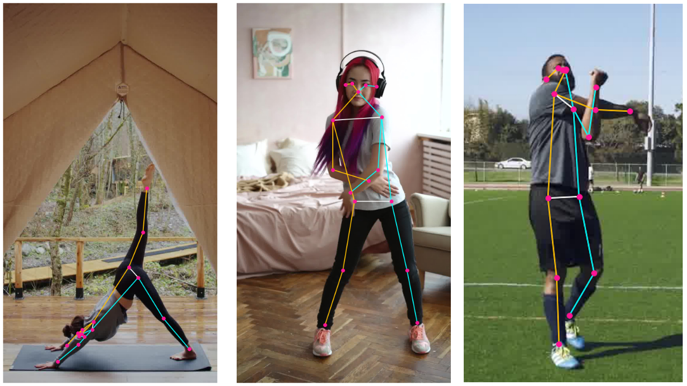

# AIM your BALANCE

Hi, everyone👋 \
If you are passonate gym goer, this is the perfect place to explore!!\
"AIMbalance" is a full-stack web application designed to help users improve their balance and form during workout through real-time pose detection and personal data analysis system.

## About this project
* I decided to do this project because I started to have serious imbalance of body for last 6 months and it affected my SBD (squat, deadlift, bench press) weights, performance, and overall quality of my life. Not being able to perform my best condition and power meant no growth of muscle and strength and it was **UNACCEPTABLE** for me.

* You might lift weights by just looking at your posture through mirror and trying to fix form intentionally, but it is definitely not the most ideal way to fix, and it would rather cause other serious injuries. Your exercises have to be performed with natural movement without disturbance. 
* So, how should we deal with it? The answer is finding **fundamental reasons** that cause imbalance form. Let's say when you do shoulder press and you notice your right arm is going upper than the other one. You should not just think your right arm is stronger than the other one in that moment. Rather, you should find out whether your Pectorails minor is tight, Scapulae is imbalanced, or core muscle is weak through personal data and analysis.

    ***AIMbalance can help you***

## Pose Detection with MoveNet

Pose estimation involves using computer vision techniques to identify the positions of key human joints (17 key points), such as the elbow, in images and videos. It's important to note that while pose estimation can locate these joints, it does not identify the person in the image or video.
> **Note:** This GIF is sourced from the [TensorFlow Blog](https://blog.tensorflow.org/2021/05/next-generation-pose-detection-with-movenet-and-tensorflowjs.html) and is used under the Apache 2.0 License.

## 💻 Tech Stack

- **Frontend:**
  - **HTML5** and **CSS3**: Structuring and styling the user interface.
  - **JavaScript** and **React.js**: Managing the dynamic behavior and components of the application.
- **Backend:**
  - **Node.js** and **Express.js**: Handling server-side logic and API requests.
  - **MySQL**: Managing and storing relational data.
- **Libraries and Tools:**
  - **TensorFlow.js**: For running the MoveNet model in the browser.
  - **MoveNet**: The pose estimation model used for detecting human poses.
  - **Axios**: For making HTTP requests to the server.

## ©️Licensing
This project is licensed under the [MIT](https://choosealicense.com/licenses/mit/) License.

### Third-Party Licenses

- **TensorFlow MoveNet**: This project utilizes TensorFlow's MoveNet model for pose estimation, which is licensed under the Apache License 2.0. Ensure that you comply with the Apache License 2.0 when using or distributing this model. More information can be found on the [TensorFlow website](https://www.tensorflow.org/lite/examples/pose_estimation/overview).

- **GIF Usage**: The GIF used in this project, sourced from TensorFlow's official blog, is also under the Apache License 2.0. Proper credit is given, and usage complies with the terms of the Apache License 2.0.

